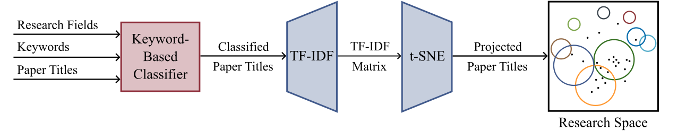

# Decoding Academic Departments: A Publication-Centric Methodology
## Uncovering Tübingen's Machine Learning Research Network and Themes

This repository contains the code and resources for analyzing and visualizing research dynamics within academic groups.
Our goal is analyzing and visualizing research dynamics within
specific academic groups, like university departments,
 using publication data alone. The analysis,
applied to the Machine Learning Department at
the University of Tübingen, occurs in two stages:
basic data analysis of publication metrics and 
advanced analysis using word embeddings to understand
research areas and connections within
the group.

## Repository Structure
- `doc/fig`: [All results from the report can easily be reproduced using the jupyter notebooks]
- `exp`: [For further analysis and more in depth code]
- `plt`: [Contains figures for visualizations over the time of the department]

## Methodology Overview

The methodology for the analysis can be summarized as:

**1. Data Metrics & Co-authorship Analysis**
- Straightforward analysis of publication and co-authorship data to map collaborative networks and academic output.

**2. Paper Title Classification & Research Space Visualization**
- Combining keyword-based classification of paper titles into research fields with the construction of a 2D research space using TF-IDF and t-SNE for dimensionality reduction, to visualize the evolution of research topics.

For more detailed information on each step of the methodology, please refer to the full paper available in this repository.

## Additional Interesting Plots Excluded from the Main Report

### Research Space
This plot represents a timeline-based visualization of the department's research themes, highlighting shifts in academic focus among professors over time.

### Number of Publications per scholar

### Number of Publications by Research Field

