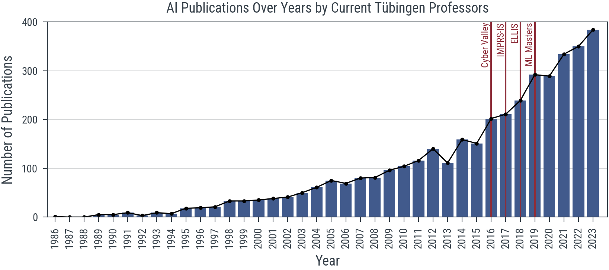
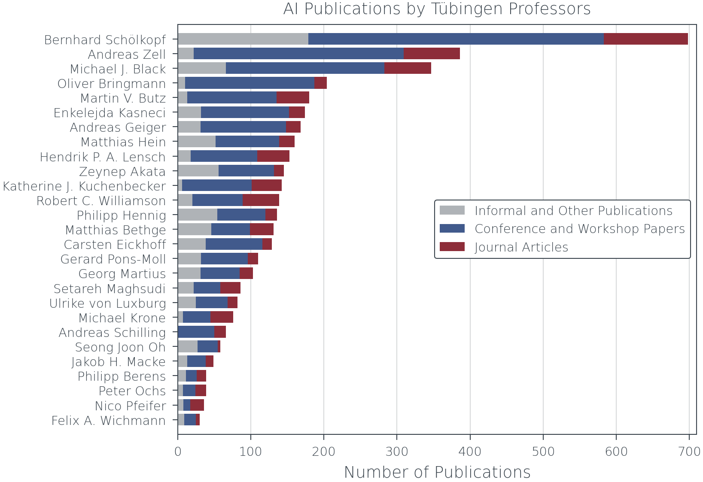
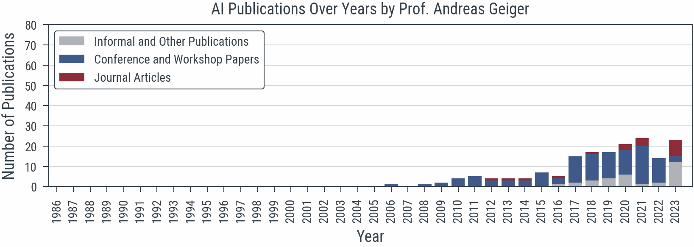
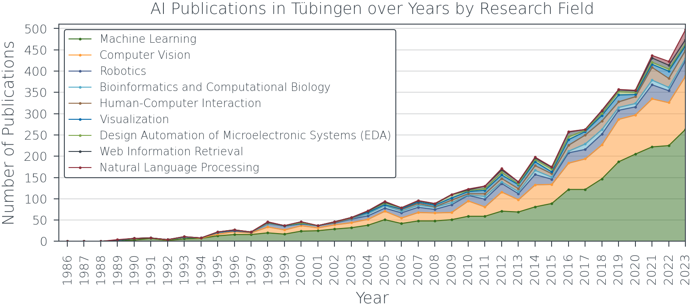
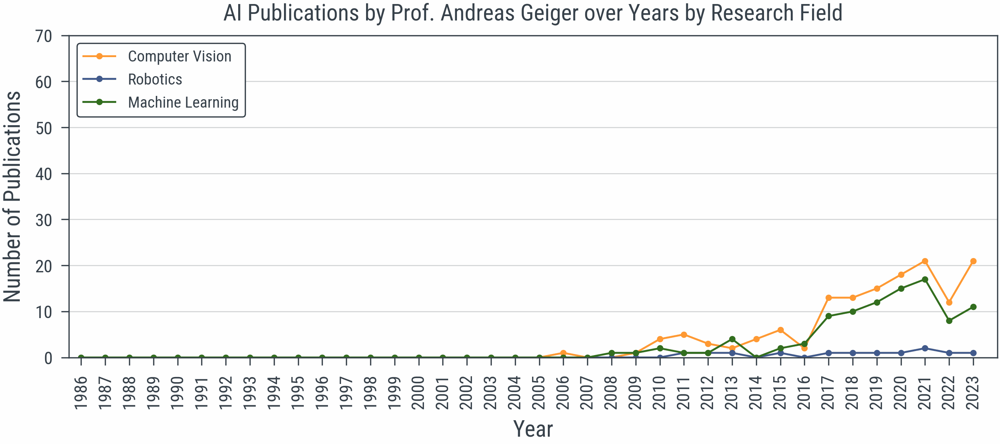
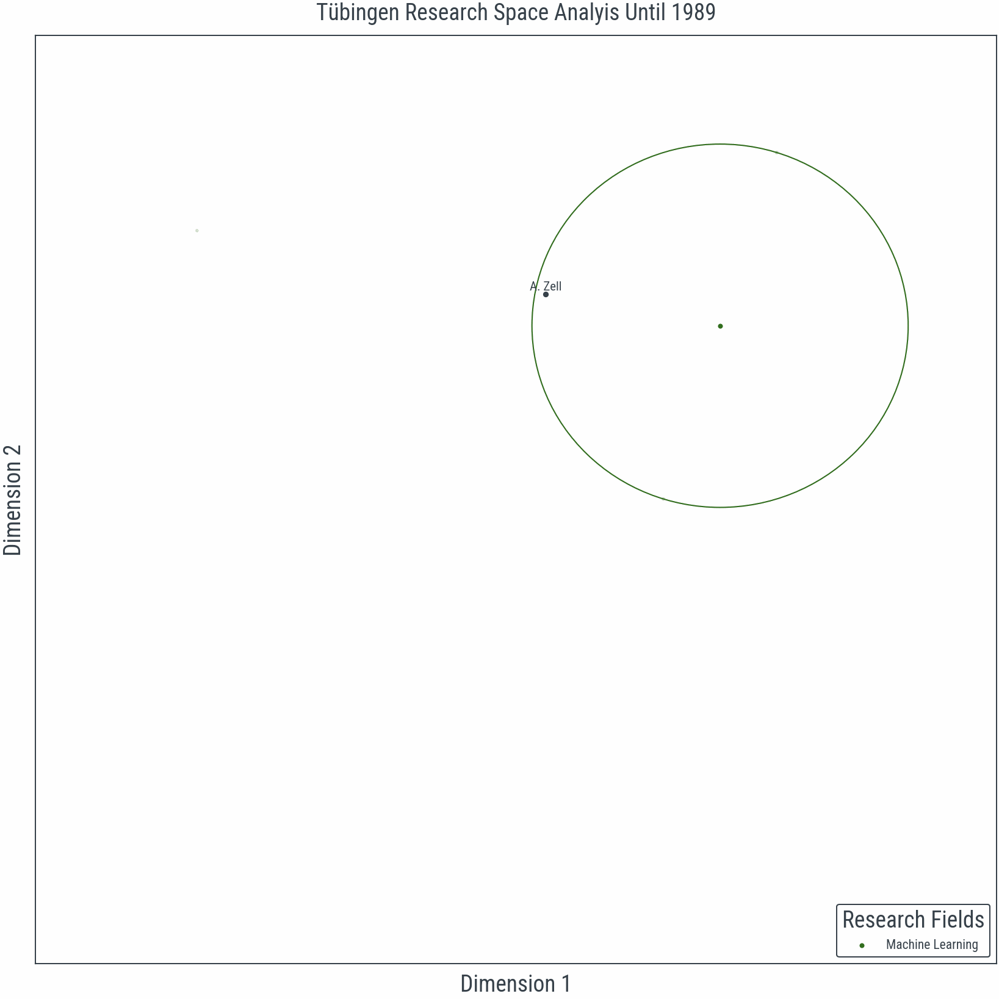
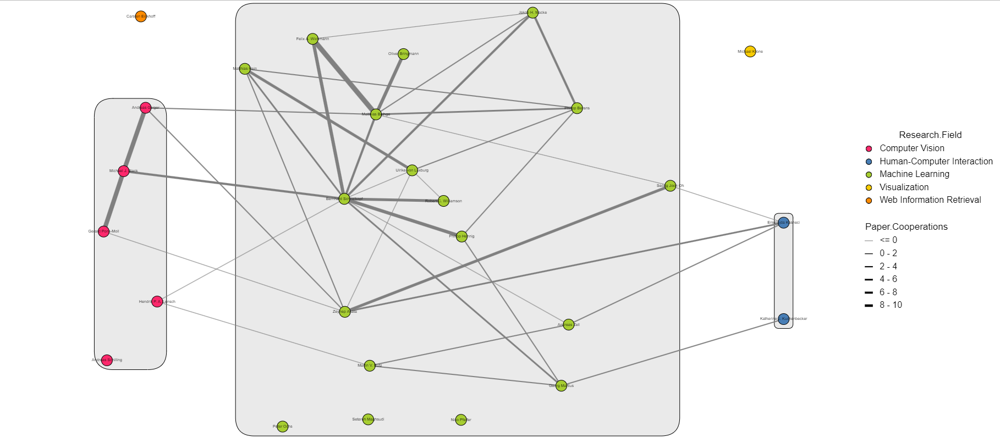
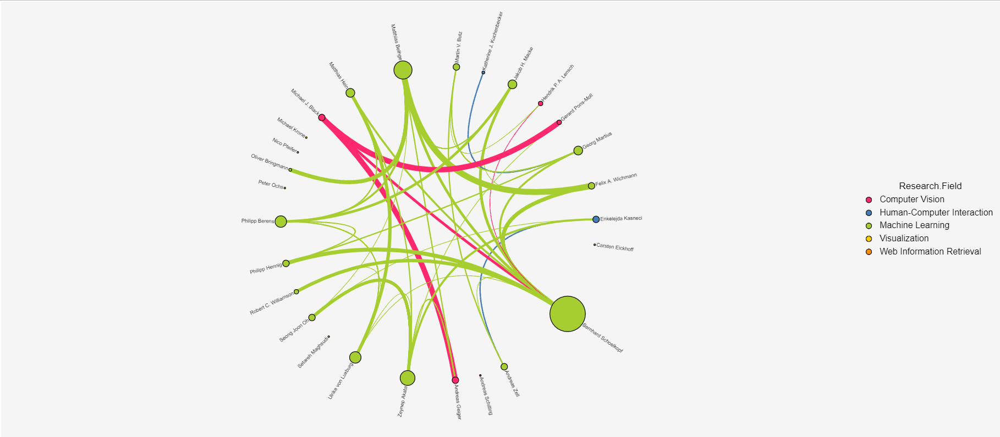
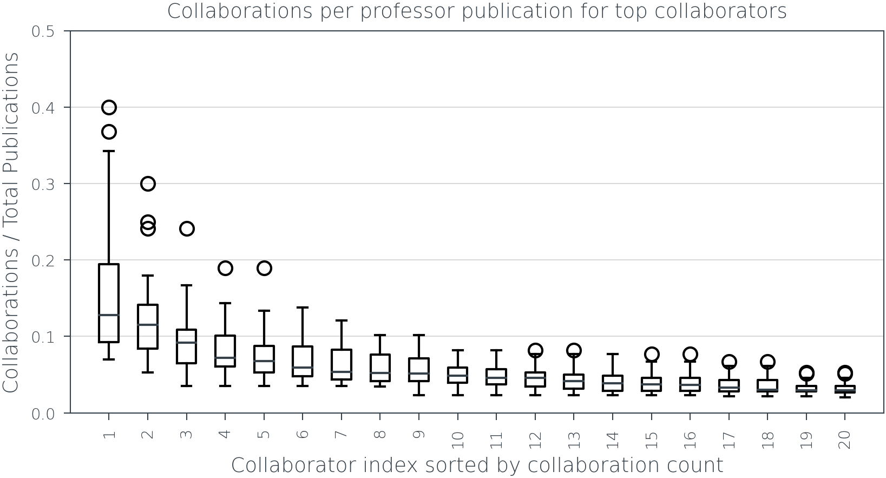
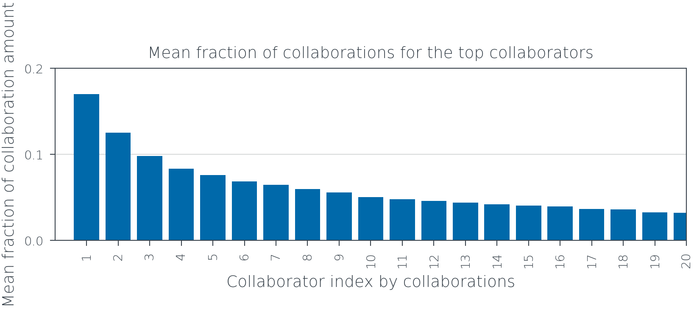

# From Titles to Insights: Uncovering Tübingen's Machine Learning Research Network and Themes

## 1. Exploratory Data Analysis

### 1.1. AI Publications per Year

### 1.2. AI Publications per Professor

### 1.3. AI Publications per Year for Each Professor

## 2. Topic Modeling

### 2.1 AI Publications per Year by Research Field

### 2.2 AI Publications per Year by Research Field for Each Professor

## 3. Research Space Analysis

## 4. Professor cooperation Networks

## 4.1 Cooperation network with research field groups

## 4.2 Circular cooperation overview

## 4.3 Top Collaborators for each Professor

## 4.4 Partition Fractions for the top Collaborators for all Professors combined

## 4.5 Mean Partition Fractions for the top Collaborators of all Professors

## 4.6 Research Space Analysis combined with Professor Cooperation Count

